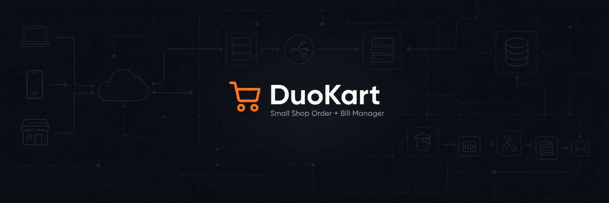

<div align="center">



**Bills never lost. Site stays up in festival rush.**


[](https://prathameshlonare.github.io/duokart/)

</div>

Two friends, one career path (AWS/DevOps), zero interest in another tutorial-copy project. Every tier below was broken by hand and fixed by hand the commit history and the tradeoff table prove it.


## What it does

| Feature | How | Why it matters |
|---|---|---|
| Shop API | Flask + gunicorn on `:5000`, behind ALB | One health-checked entry point, 2 targets min |
| Private compute | Single Multi-AZ ASG in private subnets, no public IP | Internet can only reach the app through the ALB |
| Relational data | RDS MySQL 8.0 Multi-AZ, `db.t3.micro`, private | Products, users, orders survive an AZ failure |
| Order queue | SQS Standard + DLQ after 3 receives | Poison messages park in the DLQ instead of jamming the counter |
| Order worker | Lambda `python3.12`, SQS trigger batch 1 | `RECEIVED → PACKING` conditional write, then mail |
| Split notifications | Owner gets `RECEIVED`, buyer gets `PACKING` | Each side hears what it acts on |
| Bill/photo uploads | Presigned S3 PUTs, app never proxies bytes | App stays out of the data path |
| Bastion + SSM | Jump host in public subnet, Session Manager alt | Private boxes stay reachable without public IPs |
| Observe | 8 CloudWatch alarms + dashboard, Trail, \$20 budget | DLQ depth pages before customers notice |

Proven end to end: `ord-000049` (both inboxes same mail) → `ord-000050` (split mail) → kill-1-EC2 self-heal with ALB at `200` throughout.

## Who built what - verify in git, not my words

No solo heroics. Every tier above went through alternating Discord handoffs per `WORKFLOW.md`: one types while the other reviews, then swap. Don't take this section's word for it:

```
git shortlog -sn --no-merges
```

60 commits and counting, both authors on every tier - run it and watch the names alternate. The handoff pattern matters more than any single tally:

* **Swapnil** - VPC + bastion, RDS template, S3 buckets, queue infra, observe tier (alarms/dashboard/trail/budget), self-heal drill.
* **Prathamesh** - ASG + Flask app, RDS wiring, presigned uploads, order/status board, queue mail split, E2E proofs, docs.

## Quick start (local)

**Linux:**
```
git clone https://github.com/prathameshlonare/duokart.git && cd duokart
python3 -m venv venv && source venv/bin/activate && pip install -r app/requirements.txt
cp .env.example .env && cd app && ../venv/bin/gunicorn -w 2 -b 0.0.0.0:5000 app:app
```

**Windows (PowerShell):**
```
git clone https://github.com/prathameshlonare/duokart.git; cd duokart
py -m venv venv; .\venv\Scripts\Activate.ps1; pip install -r app\requirements.txt
copy .env.example .env; cd app; ..\venv\Scripts\flask --app app run
```
(gunicorn has no Windows support, so local Windows runs the Flask dev server; deploy uses gunicorn.)

Then: `/health` → `connected`, `/products` → `Neem Soap`, `POST /orders` → `202`.

## API

| Method + path | Success | Errors |
|---|---|---|
| `POST /orders` | `202` + `{"orderId","status":"RECEIVED"}` | `400` validation / total mismatch, `409` id conflict |
| `GET /orders/:id` | `200` + `{"orderId","status","total"}` | `404` unknown id |
| `GET /products` | `200` + product list | - |
| `GET /health` | `{"status":"healthy","database":"connected"}` | - |
| `POST /uploads/url` | `200` + `{"uploadUrl","key","bucket"}` | `400` bad kind |

`total` must equal `sum(qty*price)`. Same `orderId` + same payload re-POSTs safe (`202`); same id + different payload → `409`.

```mermaid
flowchart TD

subgraph group_edge["Network and access"]
  node_vpc["VPC and subnets<br/>[01-vpc.yaml]"]
  node_alb["Application load balancer<br/>[02-compute.yaml]"]
  node_asg["Private app instances<br/>[02-compute.yaml]"]
  node_bastion["Bastion and SSM<br/>[02-compute.yaml]"]
end

subgraph group_api["Shop API"]
  node_app["Flask API<br/>[app.py]"]
  node_rds[("RDS MySQL<br/>[03-data.yaml]")]
  node_schema["Commerce schema<br/>[schema.sql]"]
end

subgraph group_orders["Order processing"]
  node_sqs["Order queue<br/>[05-queue.yaml]"]
  node_dlq["Dead-letter queue<br/>[05-queue.yaml]"]
  node_worker["Order Lambda<br/>[05-queue.yaml]"]
  node_ddb[("Order status table<br/>[05-queue.yaml]")]
  node_snsowner["Owner notifications<br/>[05-queue.yaml]"]
  node_snsbuyer["Buyer notifications<br/>[05-queue.yaml]"]
end

subgraph group_files["Bill and photo storage"]
  node_s3[("Photos and bills<br/>[04-storage.yaml]")]
  node_trailbucket[("Trail archive<br/>[04-storage.yaml]")]
end

subgraph group_ops["Operations and visibility"]
  node_cloudwatch["Alarms and dashboard<br/>[06-observe.yaml]"]
  node_cloudtrail["CloudTrail<br/>[06-observe.yaml]"]
  node_budget["Cost budget<br/>[06-observe.yaml]"]
end

node_customer(("Shop user"))
node_mail(("Email recipients"))

node_customer -->|"HTTP requests"| node_alb
node_alb -->|"forwards traffic"| node_asg
node_vpc -.->|"provisions subnets"| node_asg
node_asg -->|"runs API"| node_app
node_app -->|"queries products"| node_rds
node_app -->|"checks health"| node_rds
node_schema -.->|"defines and seeds"| node_rds
node_app -->|"sends order"| node_sqs
node_app -->|"checks and writes order"| node_ddb
node_sqs -->|"triggers"| node_worker
node_worker -->|"updates status"| node_ddb
node_worker -->|"sends received notice"| node_snsowner
node_worker -->|"sends packing notice"| node_snsbuyer
node_snsowner -->|"notifies owner"| node_mail
node_snsbuyer -->|"notifies buyer"| node_mail
node_sqs -->|"routes after 3 failures"| node_dlq
node_app -.->|"returns presigned PUT URL"| node_customer
node_customer -->|"uploads directly"| node_s3
node_asg -.->|"emits monitored signals"| node_cloudwatch
node_cloudtrail -->|"stores trail"| node_trailbucket
node_bastion -.->|"admin access"| node_asg
node_budget -.->|"tracks spend"| node_cloudwatch

click node_vpc "https://github.com/prathameshlonare/duokart/blob/main/infra/01-vpc.yaml"
click node_alb "https://github.com/prathameshlonare/duokart/blob/main/infra/02-compute.yaml"
click node_app "https://github.com/prathameshlonare/duokart/blob/main/app/app.py"
click node_asg "https://github.com/prathameshlonare/duokart/blob/main/infra/02-compute.yaml"
click node_bastion "https://github.com/prathameshlonare/duokart/blob/main/infra/02-compute.yaml"
click node_rds "https://github.com/prathameshlonare/duokart/blob/main/infra/03-data.yaml"
click node_schema "https://github.com/prathameshlonare/duokart/blob/main/infra/schema.sql"
click node_sqs "https://github.com/prathameshlonare/duokart/blob/main/infra/05-queue.yaml"
click node_dlq "https://github.com/prathameshlonare/duokart/blob/main/infra/05-queue.yaml"
click node_worker "https://github.com/prathameshlonare/duokart/blob/main/infra/05-queue.yaml"
click node_ddb "https://github.com/prathameshlonare/duokart/blob/main/infra/05-queue.yaml"
click node_snsowner "https://github.com/prathameshlonare/duokart/blob/main/infra/05-queue.yaml"
click node_snsbuyer "https://github.com/prathameshlonare/duokart/blob/main/infra/05-queue.yaml"
click node_s3 "https://github.com/prathameshlonare/duokart/blob/main/infra/04-storage.yaml"
click node_cloudwatch "https://github.com/prathameshlonare/duokart/blob/main/infra/06-observe.yaml"
click node_cloudtrail "https://github.com/prathameshlonare/duokart/blob/main/infra/06-observe.yaml"
click node_trailbucket "https://github.com/prathameshlonare/duokart/blob/main/infra/04-storage.yaml"
click node_budget "https://github.com/prathameshlonare/duokart/blob/main/infra/06-observe.yaml"

classDef toneNeutral fill:#f8fafc,stroke:#334155,stroke-width:1.5px,color:#0f172a
classDef toneBlue fill:#dbeafe,stroke:#2563eb,stroke-width:1.5px,color:#172554
classDef toneAmber fill:#fef3c7,stroke:#d97706,stroke-width:1.5px,color:#78350f
classDef toneMint fill:#dcfce7,stroke:#16a34a,stroke-width:1.5px,color:#14532d
classDef toneRose fill:#ffe4e6,stroke:#e11d48,stroke-width:1.5px,color:#881337
classDef toneIndigo fill:#e0e7ff,stroke:#4f46e5,stroke-width:1.5px,color:#312e81
class node_customer,node_mail toneNeutral
class node_vpc,node_alb,node_asg,node_bastion toneBlue
class node_app,node_rds,node_schema toneAmber
class node_sqs,node_dlq,node_worker,node_ddb,node_snsowner,node_snsbuyer toneMint
class node_s3,node_trailbucket toneRose
class node_cloudwatch,node_cloudtrail,node_budget toneIndigo
```

<details>
<summary><b>Architecture as code (mermaid)</b></summary>



</details>

<details>
<summary><b>Deploy (console-only, us-east-2, ~30 min)</b></summary>

Order matters every stack imports the one before it:

```
01-vpc (duokart-01-vpc, AdminSshCidr=YOUR-IP/32)
→ 03-data (duokart-03-data, 16+ char DB password) + 04-storage + 05-queue in parallel
→ 02-compute (duokart-02-compute) → 06-observe (paste AlbShortName/TgShortName/AlarmEmail)
```

Then once: `mysql < infra/schema.sql` on a private app box (seeds `Neem Soap`).

Nightly teardown: delete `02-compute + 03-data + 05-queue`, keep `01-vpc + 04-storage`. ~\$3.01/day when up; biggest burners are RDS Multi-AZ + ALB + NAT. Total billed to build this project: ~\$20–25 on an AWS Free Tier account.

</details>

<details>
<summary><b>Environment (.env)</b></summary>

| Var | Local example | AWS source |
|---|---|---|
| `DB_HOST / DB_PORT / DB_USER / DB_PASSWORD / DB_NAME` | `localhost / 3306 / duokart / change-me-local-only / duokart` | SSM `/duokart/dev/db-*`, injected at boot |
| `S3_PHOTOS_BUCKET / S3_BILLS_BUCKET` | `duokart-photos-local / duokart-bills-local` | SSM `/duokart/dev/s3-*` |
| `SQS_QUEUE_URL / DDB_ORDERS_TABLE` | `local / duokart-orders` | SSM `/duokart/dev/sqs-queue-url`, `/duokart/dev/ddb-orders-table` |
| `AWS_REGION` | `us-east-2` | fixed |

`.env` never enters git. DB password charset is `A-Z a-z 0-9 - _ ! #` (`%` breaks systemd).

</details>

<details>
<summary><b>Repo map</b></summary>

```
infra/01-vpc.yaml      VPC 10.0.0.0/16, 2 AZ, IGW, 1x NAT, 4 SGs
infra/02-compute.yaml  ALB + TG(:5000 /health) + ASG Min2/Max4 + bastion host
infra/03-data.yaml     RDS MySQL 8.0 Multi-AZ + SSM params
infra/04-storage.yaml  S3 photos + bills (ps-19, versioned, private) + SSM
infra/05-queue.yaml    SQS + DLQ + DDB + SNS buyer/owner + Lambda worker
infra/06-observe.yaml  8 alarms + dashboard + Trail + \$20 budget
infra/schema.sql       products / users / orders + Neem Soap seed
app/app.py             Flask API (see table above)
app/requirements.txt   flask, gunicorn, pymysql, cryptography, boto3
docs/                  live docs + days/ (day-0 → day-7 logs), api-contracts, aws-scope, deployment, destroy-checklist, demo-script
```

</details>

<details>
<summary><b>Tradeoffs (each row cost us an hour)</b></summary>

| Decision | Chose | Rejected | Why |
|---|---|---|---|
| ASG placement | Private subnets, NAT egress | Public (easy apt-get) | Public IPs on app boxes fail any serious review |
| Bills retention | `ps-19` versioned, no lock | Compliance 30d lock | Lock blocked nightly delete + forced bucket churn |
| SSM password type | `String` | `SecureString` | CFN `AWS::SSM::Parameter` rejects `SecureString` |
| Queue type | Standard SQS | FIFO | Throughput over ordering; `orderId` idempotency covers it |
| Poison handling | DLQ after 3 receives | Retry forever / drop | Counter never jams, nothing silently lost |
| Bill uploads | Presigned + optional checksum | App proxies bytes | App never touches file bytes |
| Presigned endpoint | Force `s3.us-east-2` virtual-hosted | boto3 default | Default signs `s3.amazonaws.com` → `TemporaryRedirect` |
| SSH to private | Bastion + key forwarding, SSM alt | Public IPs / shared keys | Private key never leaves the laptop |
| Edge | Deferred (no WAF / 2nd NAT / CRR / domain) | Build now | No real users; cost with zero signal |

</details>

---
<div align="center">
Build · Learn · Document · Grow - DuoKart, an AWS learning project (`us-east-2`).
</div>

