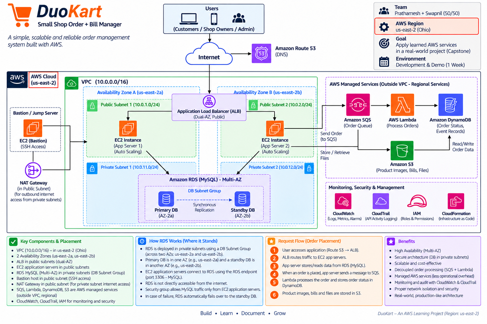
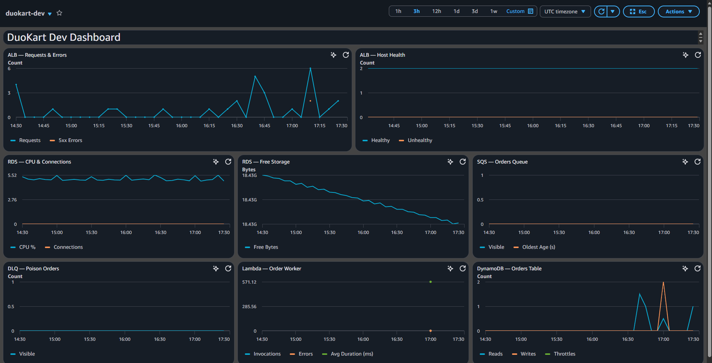
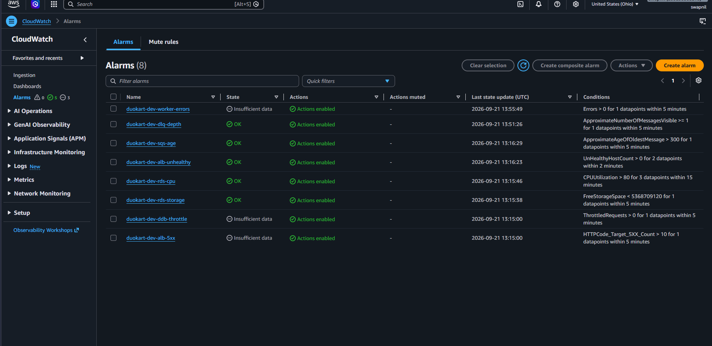
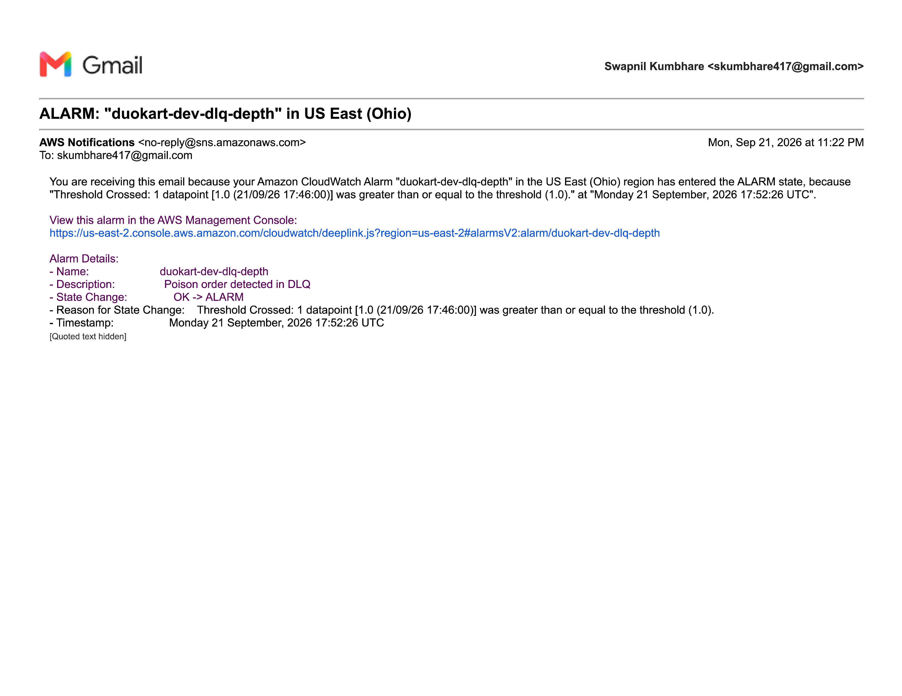
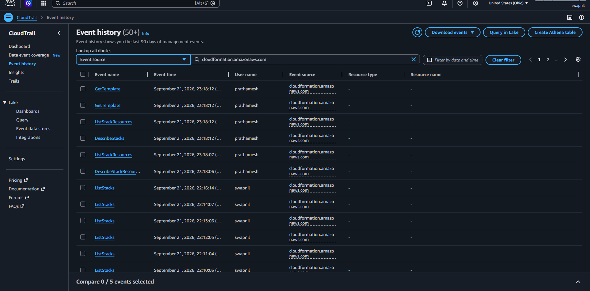
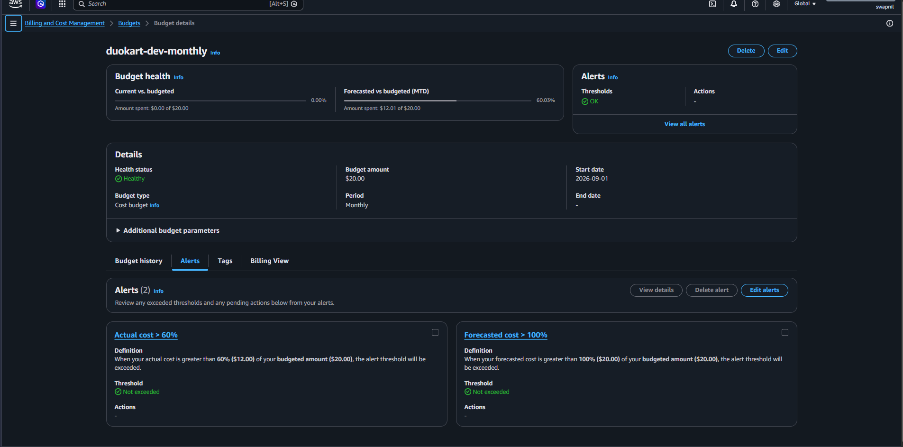
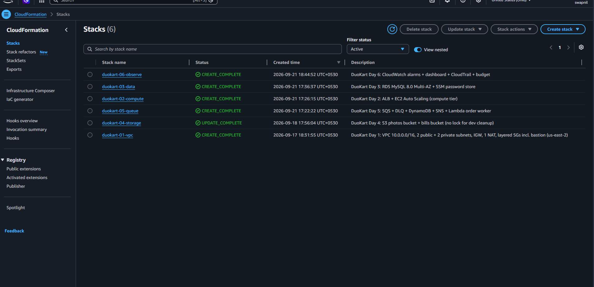

# DuoKart — Showcase (for readers who don't know AWS)

**One line:** bills never lost, site stays up in festival rush.
**Stack:** Python Flask · ALB + ASG → RDS → S3 presigned → SQS → Lambda → DynamoDB → SNS → CloudWatch alarms. `us-east-2`, console-only, ~$3.05/day up.

## Architecture

Browser → ALB → ASG/EC2 → RDS. App → SQS → Lambda → DynamoDB → SNS (buyer + owner). App → S3 presigned (photos/bills). VPC underneath, alarms + trail watching.

## Control room (`duokart-dev` dashboard)

| Panel | How to read |
|---|---|
| Requests vs 5xx | Traffic vs real crashes. >10/5min = fire, not noise |
| Healthy/Unhealthy | Dead counter before ASG finishes healing |
| RDS CPU | Sustained >80% = slow query or connection leak |
| Free Storage | <5 GB early warning on 20 GB gp2 |
| SQS age | >300s = worker dead/stuck, order unserved |
| DLQ | >0 = poison order in the wild (money panel) |
| Lambda | Invokes vs errors vs duration per order |
| DynamoDB | Reads/writes vs throttles on `duokart-orders` |

## Alarms (8, one mail thread)

| Alarm | Fires when | Why this number |
|---|---|---|
| alb-5xx | 5xx > 10/5min | Flask 500s only on real crashes |
| alb-unhealthy | unhealthy > 0, 2 min | Dead counter before replace finishes |
| rds-cpu | CPU > 80% ×3 | `db.t3.micro` bursty, sustained 80% = leak |
| rds-storage | free < 5 GB | Autoscale caps at 50 GB |
| sqs-age | oldest > 300s | Order sits 5 min unserved |
| dlq-depth | visible ≥ 1 | Any poison pages us |
| worker-errors | errors > 0 | Packer crashed (bad payload, SNS deny, DDB fail) |
| ddb-throttle | throttles > 0 | Hot `orderId` spike |

3× `Insufficient data` (5xx / worker-errors / throttles) with zero errors = healthy, not broken.

## Who built what (trail)

`CreateStack` + user names = audit receipt for the alternating-commit history.

## Wallet guard

$20 monthly: mail at 60% actual + 100% forecast. Destroy order `02→05→03→01→04`.

## Proof map

Day docs: `day-0-setup` → `day-1-network` → `day-2-compute` → `day-3-data` → `day-4-storage` → `day-5-queue` → `day-6-observe` → `day-7-ship`. Stacks: `duokart-06-observe` below.

